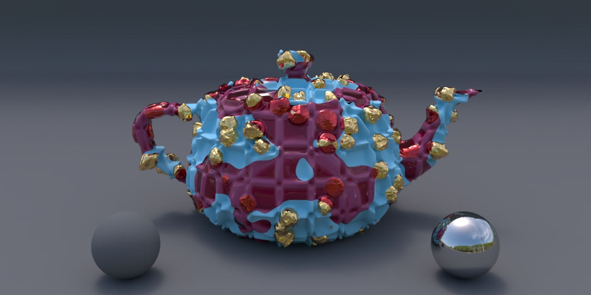

# Layered Shading (LaSh)



This repository and its associated documentation contain the latest public reference implementation of the paper [*Layering Displaced Materials with Thickness, Accumulation, and Size*]().

Similar to the [Laika Production Shading Library for RenderMan 20](https://github.com/LaikaStudios/shading-library/wiki/prman_20.Home) from which it is derived, LaSh incorporates bxdfs and displacements into its definition of a LaSh Material so that it can represent a true physical substance, and implements a bxdf and displacement layering capability so LaSh Materials can be easily layered in a physically plausible way.

Documentation is in the [`doc`](doc) directory.

As a bonus, this repository also contains an updated version of the [Siggraph 2022 OSL Shaders for RenderMan](https://dl.acm.org/doi/abs/10.1145/3532724.3535604) course [Supplementary Material](https://github.com/LaikaStudios/OSLShadersForRenderMan) shading nodes.

Please feel free to use the [Discussions Tab](https://github.com/LaikaStudios/LaSh/discussions).
I'd love you hear what you think, or to discuss any issues or thoughts you may have about this repository and its Layered Shading implementation.


# Requirements
* `make`
* `python3`
* [Pixar's RenderMan](https://renderman.pixar.com) is used in the examples
and the `make` system.
* Foundry's [Katana](https://www.foundry.com/products/katana) and its
associated [RenderMan Bridge Application](https://renderman.pixar.com/bridge-tools)
are required to make use of the high-level ShadingGroup macros,
which contain the LaSh Material Layering and other functionality packaged for use in Katana,
as well as the supplied Katana [`project`](./katana/project/) scene files.

Other rendering and application systems can still make use of the core [`osl`](./osl/) shading nodes and `make` system to assemble the necessary functionality to implement the LaSh system in those environments.

# Quick Start
To use the supplied repository content as is:

1. Set up RenderMan:

    1. Install [RenderManProServer](https://renderman.pixar.com/store) and ensure it is functioning properly.

    1. Optionally install [Katana](https://www.foundry.com/products/katana) and [RenderMan for Katana](https://renderman.pixar.com/bridge-tools) and ensure they are functioning properly.
     While optional, this step is highly recommended, as the core LaSh functionality is packaged into Katana [ShadingGroup](https://learn.foundry.com/katana/Content/ug/adding_assigning_materials/using_the_shadinggroup_node.html) macros.
     If another [RenderMan Bridge Application](https://renderman.pixar.com/bridge-tools) is used, you'll have to implement their functionality yourself using the individual [`osl`](./osl/) and [Lama](https://rmanwiki.pixar.com/display/REN25/MaterialX+Lama) shading nodes.

1. Set these environment variables appropriately. These are required by the [make](https://www.gnu.org/software/make/manual/) system that's used to compile and install the shaders:
    * PIXAR_ROOT
    * RMAN_VERSION

    For example, if your version of RenderManProServer is installed in
    `/opt/pixar/RenderManProServer-25.0`, then using `bash` shell:

    ```bash
    export PIXAR_ROOT="/opt/pixar"
    export RMAN_VERSION="25.0"
    ```
    
    Since RenderManProServer requires an RMANTREE environment variable to be set to its installation location, you can conveniently use these to define it as well:
    
    ```bash
    export RMANTREE="${PIXAR_ROOT}/RenderManProServer-${RMAN_VERSION}"
    ```

1. Download or [clone](https://docs.github.com/en/repositories/creating-and-managing-repositories/cloning-a-repository) this repository.
1. `cd` into the dowloaded or cloned repository's directory.

1. At this point, you can use the `make` or `make all` command (they are equivalent) to build the shaders.
You can also `cd osl` into the osl directory and `make` the shaders there.
The osl Makefile will only make shaders for .osl files that are more recent than their complied shader.
In this way, you can edit a source file and execute `make` from within the osl directory and only the updated source file(s) will be built.

    `make clean` and `make help` can also be executed from either the top-level directory or the osl directories.
`make clean` removes the built shaders, and `make help` provides additional information about the make system and how it's controlled.

1. Set these environment variables appropriately.
    1. This is required so the built shaders can be found by [RenderMan](https://rmanwiki.pixar.com/display/REN24/RenderMan) and a [RenderMan Bridge Application](https://renderman.pixar.com/bridge-tools):

        - RMAN_SHADERPATH

        For example, if you downloaded or cloned this repository to `${HOME}/LaSh`, then using `bash` shell:

        ```bash
        export RMAN_SHADERPATH="${HOME}/LaSh/build/${RMAN_VERSION}/shaders:${RMAN_SHADERPATH}"
        ```

    1. If you're using [Katana](https://www.foundry.com/products/katana) and you want to make use of the supplied [ShadingGroup](https://learn.foundry.com/katana/Content/ug/adding_assigning_materials/using_the_shadinggroup_node.html) macros and the shading node "alt+p" and "alt+shift+p" Shading Node Menus:

        ```bash
        export KATANA_RESOURCES="${HOME}/LaSh/build/katana:${KATANA_RESOURCES}"
        ```
        so that katana will load them when it starts.

# License
Licensed under either of

* Apache License, Version 2.0, ([LICENSE-APACHE](LICENSE-APACHE) or http://www.apache.org/licenses/LICENSE-2.0)
* MIT license ([LICENSE-MIT](LICENSE-MIT) or http://opensource.org/licenses/MIT)

at your option.
