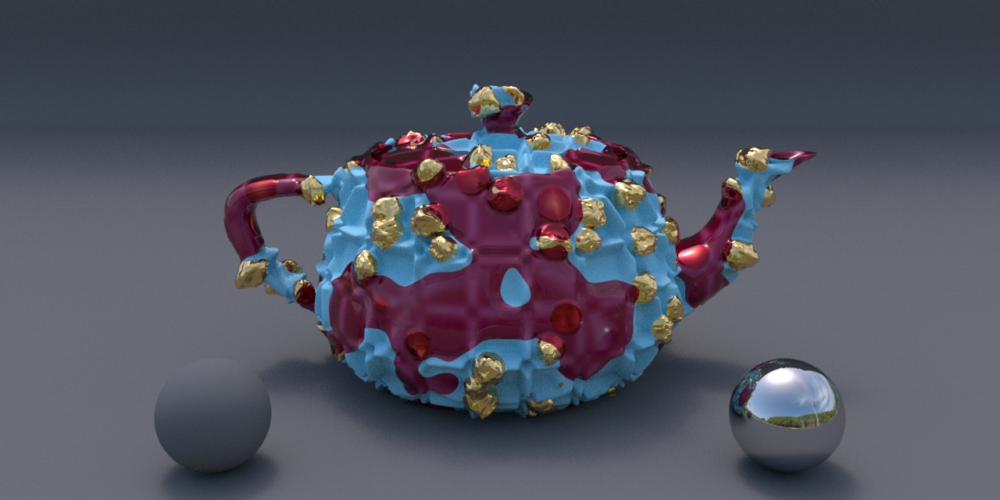

# LaSh (Layered Shading)

LaSh is a displacement-aware Material shader layering system that contains the latest reference implementation of the [*Layering Displaced Materials with Thickness, Accumulation, and Size*](https://dl.acm.org/doi/10.1145/3603521.3604289) paper.

Derived from the [Laika Production Shading Library for RenderMan 20](https://github.com/LaikaStudios/shading-library/wiki/prman_20.Home),
LaSh incorporates bxdfs and displacements into its definition of a LaSh Material shader so that it can represent a true physical substance,
and implements a bxdf and displacement-aware layering capability so LaSh Material shaders can be easily and intuitively layered over one another in a physically plausible way.

All documentation is in the [`doc`](doc) directory.

As a bonus, this repository also contains the [Siggraph 2024 Shader Writing in Open Shading Language](https://dl.acm.org/doi/10.1145/3664475.3664534) course [Supplementary Material](https://github.com/LaikaStudios/OSLShaderWriting) shading nodes.

Please feel free to use the [Discussions Tab](https://github.com/LaikaStudios/LaSh/discussions).
I'd love you hear what you think, or to discuss any issues or thoughts you may have about this repository and its Layered Shading implementation.

# License
This repository's content is licensed under either the

* Apache License, Version 2.0, ([LICENSE-APACHE](LICENSE-APACHE) or http://www.apache.org/licenses/LICENSE-2.0) or
* MIT license ([LICENSE-MIT](LICENSE-MIT) or http://opensource.org/licenses/MIT)

at your option.

