
# LaSh

LaSh is a Material layering system for use with RenderMan based on the paper [*Layering Displaced Materials with Thickness, Accumulation, and Size*]().
Derived from the [Laika Production Shading Library for RenderMan 20](https://github.com/LaikaStudios/shading-library/wiki/prman_20.Home), it has been expanded upon and reimplemented using the latest shading and rendering technology.

LaSh implements these key features:

   * It combines a material's bxdf response(s) and its displacement into an encapsulated Material definition.
In this way, a LaSh Material contains all the information about a Material's optical and physical properties in a single atomic object,
representing a true physical substance.

   * It combines the encapsulated Material definition with a physically plausible bxdf and displacement layering capability.
This layering implementation uses the artistically intuitive notions of Thickness and Accumulation, along with the layered Materials' displacement and bxdf properties, to produce a new physically plausible Material result representing their layered combination.

   * It uses a universal pattern variation metric and control parameter called Size that simultaneously modifies a displaced pattern's variation and magnitude with a single control, while at the same time providing information about the accumulated bulk of layered Materials.

The strength of the LaSh system is derived from these capabilities, resulting in its ability to define a library of self-contained, displaced Materials that can easily be combined or layered in a flexible, intuitively controlled, yet physically plausible way simply by connecting them in the desired layering order.

The rest of this documentation assumes you have read and are familiar with the contents of the [*Layering Displaced Materials with Thickness, Accumulation, and Size*]() paper, as it is only concerned with the implementation of that system and is not designed to be a separate tutorial about it.

## Table of Contents

1. [The LaSh Material](#the-lash-material)
1. [Examples](#examples)
    1. [Thickness, Accumulation, and Bulk](#thickness-accumulation-and-bulk)
    1. [Thickness, Accumulation, and Tau Scale](#thickness-accumulation-and-tau-scale)
    1. [Rusting Painted Metal](#rusting-painted-metal)
    1. [Layering Multiple Materials](#layering-multiple-materials)
    1. [Mixing Materials](#mixing-materials)
1. [Katana Macros](#katana-macros)
    1. [LashMaterial](#lashmaterial)
    1. [LashLayer](#lashlayer)
    1. [LashLayers](#lashlayers)
    1. [LashMix](#lashmix)
    1. [LashSurface](#lashmix)
1. [Enhancements](#enhancements)
    1. [Cascading Displacement](#cascading-displacement)
    1. [Daisy Chained Materials](#daisy-chained-materials)
    1. [LashCascade Macro](#lashcascade-macro)

## The LaSh Material

A LaSh Material (**LaM**) is composed of two parts: its LaSh Bxdf (**LaB**) and its LaSh Displacement (**LaD**).
This is similar to a [MaterialX](https://materialx.org/) **Material Node** that contains both a surface shader and a displacement shader.

A **LaB** is composed of a [Lama Bxdf](https://rmanwiki.pixar.com/display/REN25/MaterialX+Lama) - which can itself be composed of any number of Lama Bxdfs combined in whatever way you want - plus its *Mask*.
The *Mask* defines where the LaB is present and where it isn't (or any intermediate value as well).
The LaB *Mask* typically has a relatively sharp transition to 0 at the edge of where the Material ends (assuming it's not present everywhere, in which case the *Mask* is a constant value of 1).

A **LaD** is composed of several parts.
The first is the displacement itself, which is represented as the change in the surface point: *DeltaP*.
As explained in the [Siggraph 2022 OSL Shaders for RenderMan](https://dl.acm.org/doi/abs/10.1145/3532724.3535604) course, this is a much more efficient and useful displacement representation than the displaced point itself.
The LaD *Bulk* is another critical displacement-related value.
It allows LaDs to accumulate as they're layered over each other.
The LaD *Mask* defines the displacement transition at the edge of the Material.
A LaD *Mask* needs a slightly "softer" transition than the LaB *Mask*, since rendered displacement does not respond well to severe discontinuities, and abrupt displacement transitions also aren't very realistic looking.

Next are the LaD layering controls: *Thickness* and *Accumulation*.
These provide the user with the ability to adjust the physical characteristics of the layered displacement's composition.
*Thickness* determines what percentage of the underlying displacement
remains or is obliterated by the overlying LaD being applied.
And *Accumulation* determines whether the applied LaD’s displacement will result in the build-up of material in the resulting surface:
when displacements accumulate, they increase the resulting Material's *Bulk*.

Two additional values are contained in the [LaD struct](../osl/include/LaD.h): *Tau Scale* and *Nd*.
*Tau Scale* is used to make any necessary or desired correction to the *Bulk*'s effect on the optical thickness of the layered BxDFs, and *Nd* contains the previous LaD's displaced surface normal in order to allow the possibility of cascading height-based displacements.

**Note:** the displacement *Size* attribute described in the paper has been renamed *Bulk* in this implemenation to disambiguate it from the *Size* pattern variation (a.k.a. signal) attribute, and the **Size** pattern generation control parameter. See **Section 3** and **Section 5** of the paper for more information about Size.

[TOC](#table-of-contents)

## Examples

These examples use the supplied [Katana Macros](#katana-macros) to define the encapsulated LaSh Materials, their layering, and their translation into a prmanBxdf and prmanDisplacement.

### Thickness, Accumulation, and Bulk

The [`katana/project/ThickAndAccum.katana`](../katana/project) file can be used to explore the effects of *Thickness* and *Accumulation* on the layered Materials and the resulting *Bulk*.
This scene can be used to generate the images in **Figure 6** of the paper.
Two opaque Materials are layered (small green bumps over large blue bumps), and the resulting *Bulk* value is shown in grey-scale.

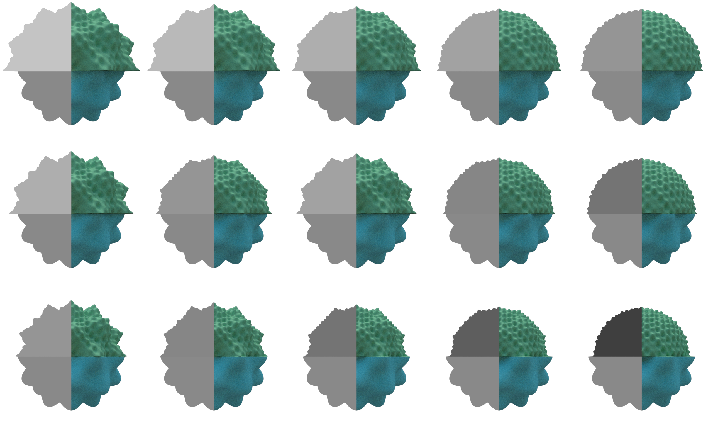
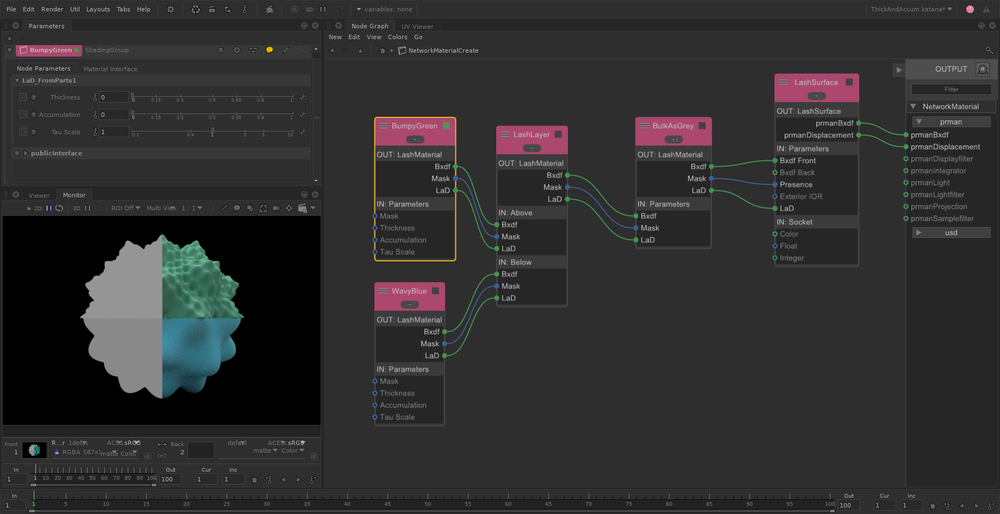

[Top](#Top)
[TOC](#table-of-contents)

### Thickness, Accumulation, and Tau Scale

The [`katana/project/Tau.katana`](../katana/project) file can be used to explore the effects of *Thickness*, *Accumulation*, and *Tau Scale* on the resulting layered Material. This scene can be used to generate the images in **Figure 7** of the paper.
Transparent cherry syrup is layered over a blue waffle, showing the effects of *Thickness*, *Accumulation*, and *Tau Scale* on the resuling optical thickness (Tau) of the layered result.

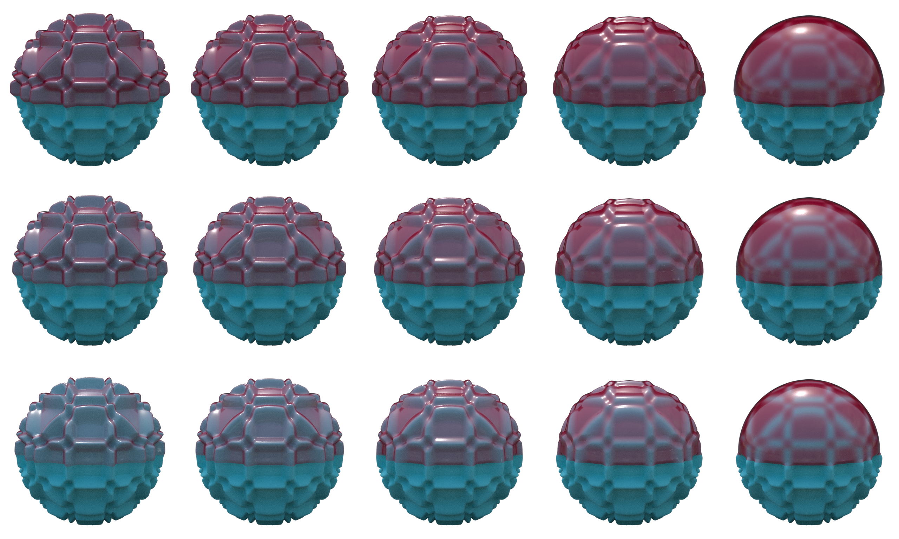
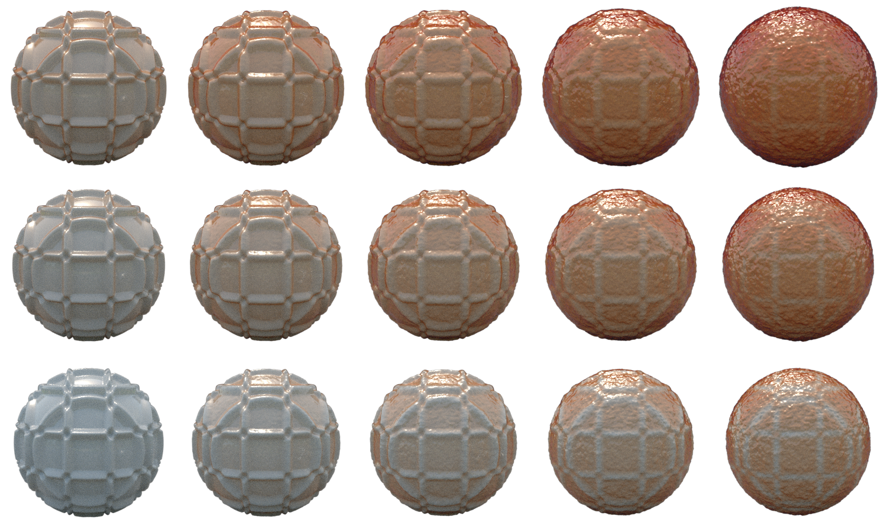

[Top](#Top)
[TOC](#table-of-contents)

### Rusting Painted Metal

The [`katana/project/RustingPainedMetal.katana`](../katana/project) file contains an example of a high-level Material node discussed in the paper's **Results Section 6**
It uses an Age parameter to control procedurally generated patterns which define separate LaB and LaD *Mask* values and displacement.
Note this file does not generate the *Mask* values and displacement pattern shown in **Figure 9** and **10** of the paper, which use fixed patterns.

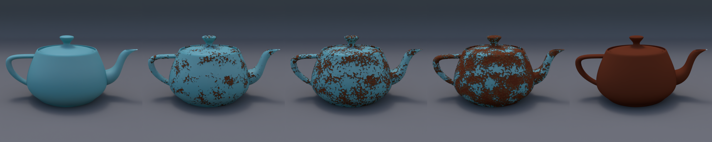
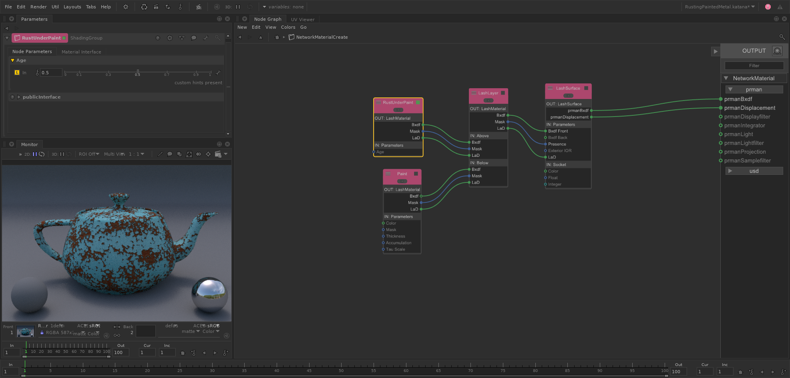

[Top](#Top)
[TOC](#table-of-contents)

### Layering Multiple Materials

The [`katana/project/Layers.katana`](../katana/project/) file uses the supplied [LashLayers](#lashlayers) macro to layer up to six LaSh Materials.
Three are layered here, but the scene contains two others so you can easily experiment with the layering functionality.

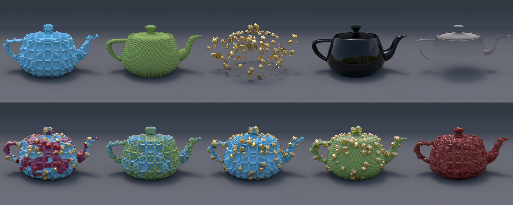
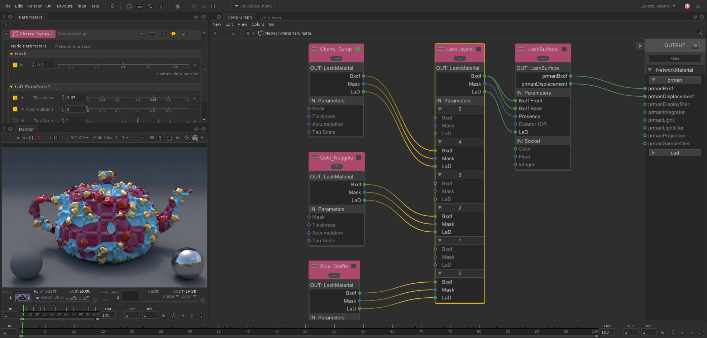

[Top](#Top)
[TOC](#table-of-contents)

## Mixing Materials

The [`katana/project/Mix.katana`](../katana/project/Mix.katana) file uses the supplied [LashMix](#lashmix) macro to blend between two Materials.

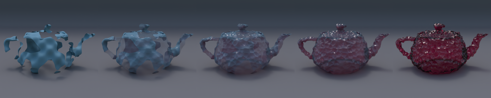
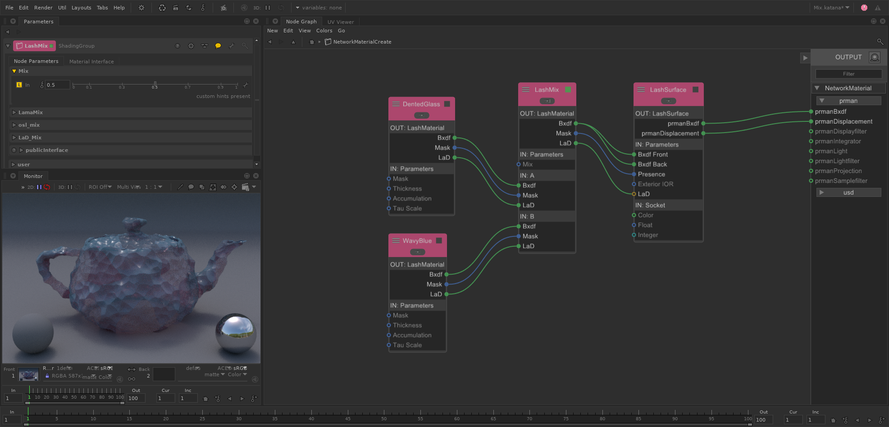

[Top](#Top)
[TOC](#table-of-contents)

## Katana Macros

The [Katana](https://learn.foundry.com/katana/6.0/Content/learn_katana.html) [**ShadingGroup**](https://learn.foundry.com/katana/Content/ug/adding_assigning_materials/using_the_shadinggroup_node.html) Macros implement the core functional blocks shown in **Figure 2**, **3**, and **4** of the paper.
There are also additional macros that provide other useful functionality.
Other than the [LashMaterial](#lashmaterial) macro, which contains a Material created by the user, the contents of these ShadingGroup Macros are not altered or exposed.

If you are using another application's shading system, you'll need use that system's shading capabilities to assemble these functional blocks yourself with the supplied [osl](../osl) shading nodes.

### LashMaterial

This macro contains the core set of nodes and UI parameters used to define an encapsulated [LaSh Material (LaM)](#the-lash-material).
It is useful as a starting point for creating any LaSh Material, and was the starting point for all the Material nodes used in the [Examples](#examples).
Its content is used to define all the characteristics of the desired Material in a self-contained shading network.

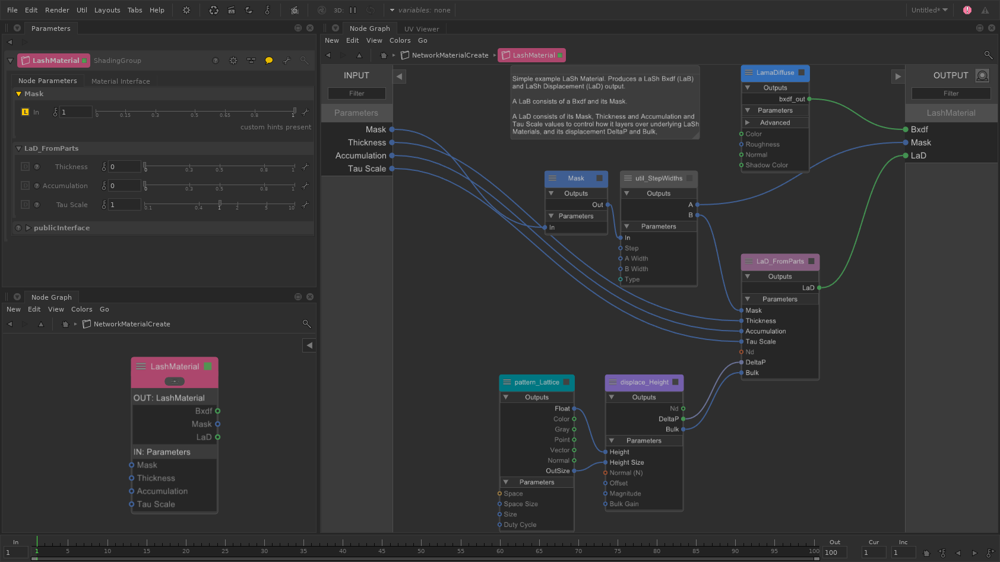

[Top](#Top)
[TOC](#table-of-contents)

### LashLayer

This macro is a direct implementation of the block diagram shown in **Figure 3** of the paper.
The [LaD_Layer](../osl/LaD/Layer.osl) shading node implements both **Listing 2** and **Listing 3** components from the paper that are referenced in the **Figure 3** block diagram.

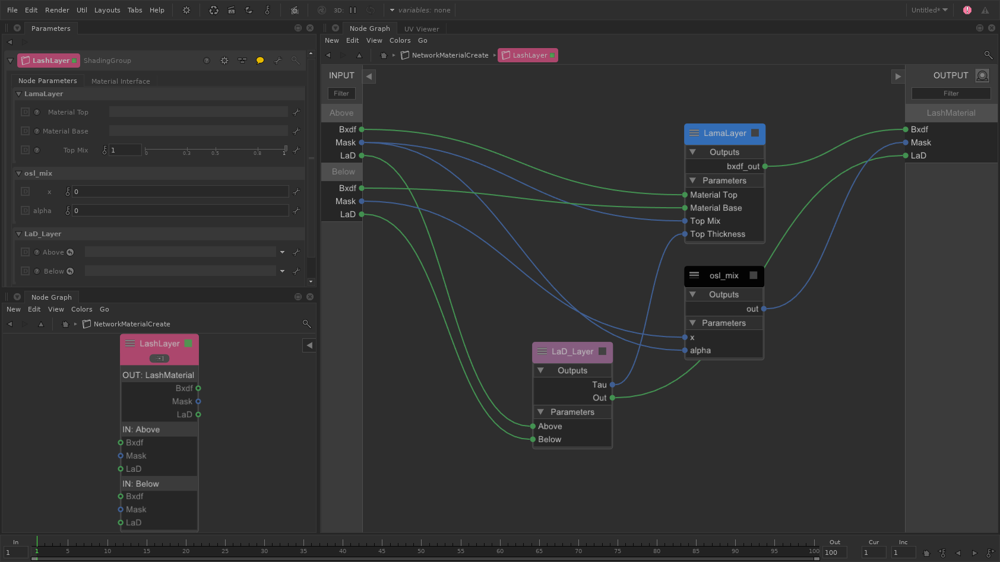

[Top](#Top)
[TOC](#table-of-contents)

### LashLayers

This macro contains a number of cascaded [LashLayer](#lashlayer) macros as a convenience, and allows up to six LaSh Materials to be easily layered with a single node.

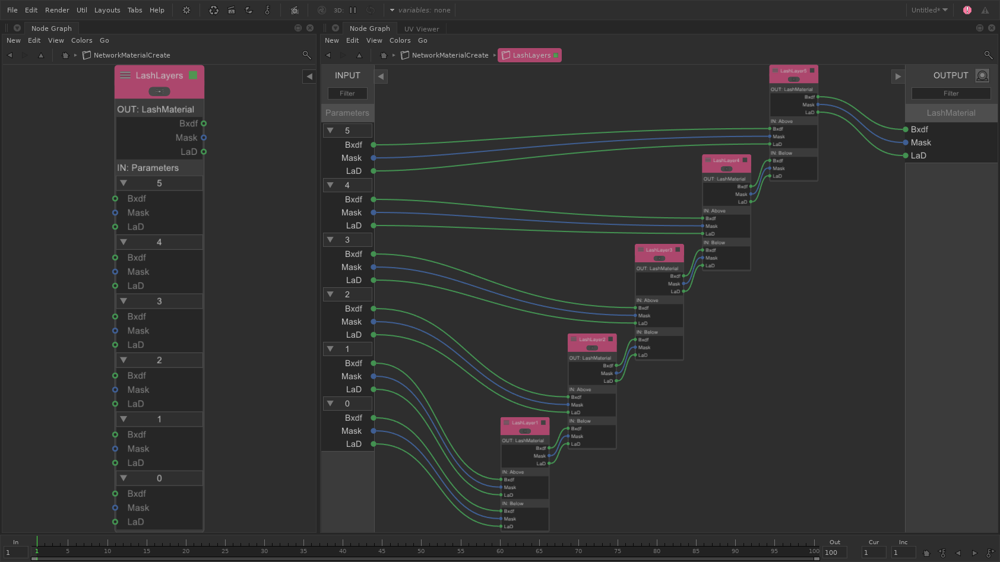

[Top](#Top)
[TOC](#table-of-contents)

### LashMix

This macro does a simple blend between any two LaSh Materials, linearly interpolating all their Material properties.

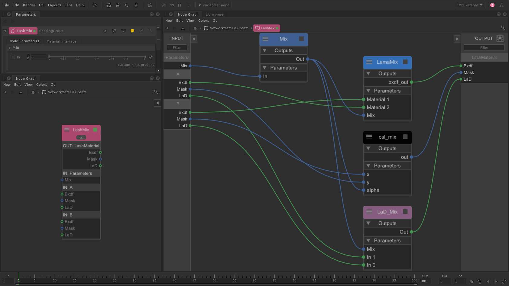

[Top](#Top)
[TOC](#table-of-contents)

### LashSurface

This macro implements the conversion of a LaSh Material into prmanBxdf and prmanDisplacement as shown in **Figure 4** of the paper.
It exposes all the [LamaSurface](https://rmanwiki.pixar.com/display/REN25/LamaSurface) parameters for controlling the RenderMan BxDF shading functionality.

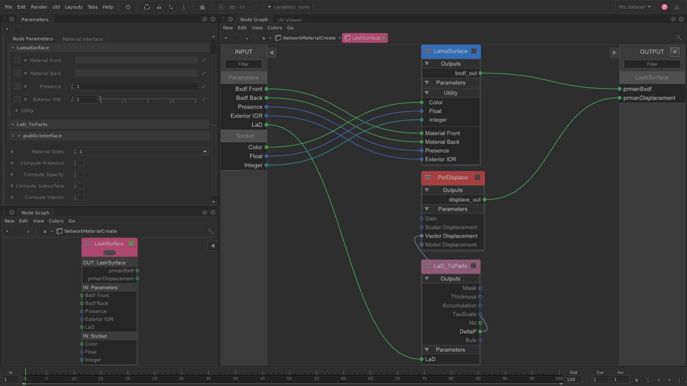

[Top](#Top)
[TOC](#table-of-contents)

## Enhancements

### Cascading Displacement

**Section 7.3** of the paper describes an enhancement based on cascading height-based displacements.
In order to support this possibility, the implementation has been updated to include *Nd* in its [LaD_struct](../osl/include/LaD.h) defintion.

### Daisy Chained Materials

Rather than using the [LashLayer](#lashlayer) or the [LashLayers](#lashlayers) node to define the layering order of Materials, the layering functionality of **Figure 3** in the paper can be incorporated into a Material's definition.
In this way, the Material node has a LaSh Material (LaM) input and output, and the layering order is determined by the order in which the chained Material nodes are connected.
This also allows Materials to use [Cascading Displacement](#cascading-displacement).

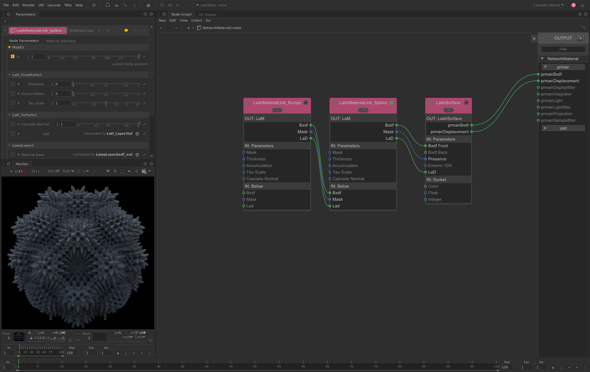

### LashCascade Macro

This macro incorporates both of the previous enhancements, allowing for an alternate Material interconnection graph as shown in [Daisy Chained Materials](#daisy-chained-materials).
It does so by combining a slightly modified shading graph from the [LashMaterial](#lashmaterial) macro that uses the Below Material's [LaD_struct.Nd](../osl/include/LaD.h) to define the **displace_Height** Normal direction, and an internal [LashLayer](#lashlayer) macro to layer the LaSh Material's shading graph over the Below Material input.
Given its greater functionality and cleaner top-level Material Layering interconnection graph, this is the preferred Material definition macro over the [LashMaterial](#lashmaterial) macro layered with the [LashLayer](#lashlayer) or [LashLayers](#lashlayers) macros.

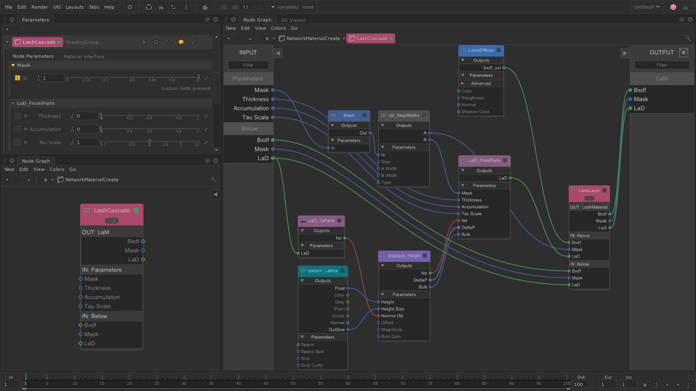 

[Top](#Top)
[TOC](#table-of-contents)

