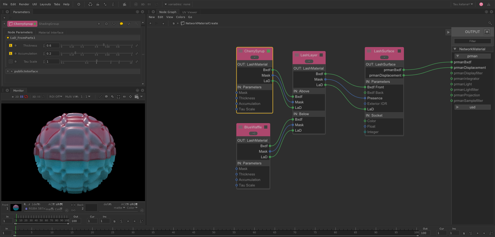

# LaSh

LaSh (Layered Shading) is a displacement-aware Material shader layering system based on the paper [*Layering Displaced Materials with Thickness, Accumulation, and Size*](https://dl.acm.org/doi/10.1145/3603521.3604289).
Derived from the [Laika Production Shading Library for RenderMan 20](https://github.com/LaikaStudios/shading-library/wiki/prman_20.Home), it has been expanded upon and reimplemented using the latest shading and rendering technology.

LaSh implements these key features:

   * It combines a material's bxdf and displacement into an encapsulated Material shader definition.
In this way, a LaSh Material contains all the information about a Material's optical and physical properties in a single atomic shader object,
representing a true physical substance.

   * It combines the encapsulated Material shader definition with a physically plausible bxdf and displacement layering capability.
This layering implementation uses the artistically intuitive notions of Thickness and Accumulation, along with the layered Materials' displacement and bxdf properties, to produce a new physically plausible Material result representing their layered combination.

   * It uses a universal pattern variation metric and control parameter called Size that simultaneously modifies a displaced pattern's scale and magnitude with a single control, while at the same time providing information about the accumulated bulk of layered Materials.

The strength of the LaSh system is derived from these capabilities, resulting in its ability to define a library of self-contained, displaced Material shaders that can easily be combined or layered in a flexible, intuitively controlled, yet physically plausible way simply by connecting them in the desired layering order.

While the system contained herein is implemented using [RenderMan](https://rmanwiki.pixar.com) and [Katana](https://www.foundry.com/products/katana), any suitable rendering and shading application framework may be used.

## Table of Contents

1. [The LaSh Material](#the-lash-material)
    1. [Displacement Layering](#displacement-layering)
1. [LaSh Nodes](#lash-nodes)
    1. [Material Creation](#material-creation)
        1. [LaSh_MaterialLink](#lash_materiallink)
        1. [LaSh_Material](#lash_material)
    1. [Material Combination](#material-combination)
        1. [LaSh_Add](#lash_add)
        1. [LaSh_Mix](#lash_mix)
        1. [LaSh_Layer](#lash_layer)
    1. [LaSh_Surface](#lash_surface)
1. [Examples](#examples)
    1. [Adding](#adding)
    1. [Mixing](#mixing)
    1. [Layering](#layering)
        1. [Thickness, Accumulation, and *Bulk*](#thickness-accumulation-and-bulk)
        1. [Thickness, Accumulation, Tau Scale, and *Tau*](#thickness-accumulation-tau-scale-and-tau)
        1. [Cascade Normal and *Nd*](#cascade-normal)

## The LaSh Material

A LaSh Material (**LaM**) is composed of two parts: its LaSh Bxdf (**LaB**) and its LaSh Displacement (**LaD**).
This is similar to a [MaterialX](https://materialx.org/) Material Node that contains both a surface shader and a displacement shader.
However, the LaSh system provides enhanced capabilites that MaterialX does not.

A **LaB** is composed of a RenderMan [Lama Bxdf](https://rmanwiki.pixar.com/display/REN/MaterialX+Lama) - which can itself be composed of any number of Lama Bxdfs combined in whatever way you want - plus its **Mask**.
The LaB Mask defines where the LaB is present and where it isn't (or any intermediate value as well).
The Mask typically has a relatively sharp transition to 0 at the edge where the Material ends (assuming it's not present everywhere, in which case the Mask is a constant value of 1).
If you're implementing this in another rendering system, you'll need to replace the Lama Bxdf nodes with that system's equivalent BxDF shading nodes.

A **LaD** is composed of several parts.
The first is the displacement itself, which is represented as the change in the surface point: *DeltaP*.
As explained in the
[*Shader Writing in Open Shading Language*](https://www.routledge.com/Shader-Writing-in-Open-Shading-Language-with-RenderManr-Examples/Prater/p/book/9781032421100) book,
this is a much more efficient and useful displacement representation than the displaced surface point itself.
The LaD *Bulk* is another critical displacement-related value.
It allows LaDs to accumulate mass as they're layered over each other.
The LaD **Mask** defines the displacement transition at the edge of the Material.
A LaD Mask may need a slightly "softer" transition than the LaB Mask, since rendered displacement does not respond well to severe discontinuities, and abrupt displacement transitions also aren't very realistic looking.

**Note**: ideally a LaSh Material (LaM) would be expressed as a single connection between [LaSh Nodes](#lash-nodes).
However, due to the closed-source status of the [ILM](https://www.ilm.com/) [MaterialX Lama](https://rmanwiki.pixar.com/display/REN/MaterialX+Lama) system in RenderMan, the BxDF portion of a LaSh Material must be separate from its own Mask and the LaD struct.

### Displacement Layering

[**Thickness**](#thickness-accumulation-and-bulk) and [**Accumulation**](#thickness-accumulation-and-bulk)
provide the user with the ability to adjust the physical characteristics of the layered displacement composition.
Thickness determines what percentage of the underlying displacement
remains or is obliterated by the overlying Material's displacement.
Accumulation determines whether the applied LaD’s displacement will result in the build-up of material in the resulting surface:
when displacements accumulate, they increase the resulting layered Material's [*Bulk*](#thickness-accumulation-and-bulk).

Two additional values are contained in the [LaD struct](../osl/include/LaD.h):
[**Tau Scale**](#thickness-accumulation-tau-scale-and-tau) and [*Nd*](#cascade-normal).
Tau Scale is used to make any necessary or desired correction to the *Bulk*'s effect on the optical thickness of the layered BxDFs, and *Nd* contains the underlying LaD's displaced surface normal in order to allow the possibility of cascading height-based displacements.
The degree to which this is done is adjusted by the [**Cascade Normal**](#cascade-normal) control.

**Note:** the displacement *Size* attribute described in the paper has been renamed *Bulk* in this implemenation to disambiguate it from the **Size** pattern generation control parameter and
the pattern variation (signal wavelength) *Size* attribute.
See **Section 3** and **Section 5** of the paper for more information about Size.

[Top](#Top)
[TOC](#table-of-contents)

## LaSh Nodes

[Katana](https://learn.foundry.com/katana/Content/learn_katana.html) [**ShadingGroup**](https://learn.foundry.com/katana/Content/ug/adding_assigning_materials/using_the_shadinggroup_node.html) Macros are used in this implementation to provide the core functional blocks shown in **Figure 2**, **3**, and **4** of the paper as well as additional capabilities.
Other than the [Material Creation](#material-creation) nodes, the contents of these ShadingGroups are not altered or exposed to the user.

If you are using another application's shading system, you'll need use that system's shading capabilities to assemble these functional blocks yourself with the supplied [`osl`](../osl) shading nodes, or translate them into a different shading langauge.

### Material Creation

These nodes contain a simple Material shading network and the set of connections and controls necessary for the LaSh system functionality.
When creating a new LaSh Material, replace the simple shading network with your own Material shading network.

Since these are ShadingGroup nodes, if necessary, you can add your own input/output connections to create more advanced LaSh Materials that allow them to communicate additional information to each other.
This should only be necessary in special circumstances however as the LaSh system provides all the Material interfacing necessary for the majority of use cases.

**Note**: due to a [bug](https://renderman.pixar.com/forum/forum/support/renderman-pro-server/26788-lamalayer-bug) in the [LamaLayer](https://rmanwiki.pixar.com/space/REN/19661467/) node, you must choose between using [LaSh_Material](#lash_material) nodes plus [LaSh_Layer](#lash_layer) to do Material layering,
or using [LaSh_MaterialLink](#lash_materiallink) nodes and daisy-chaining them to define a layered Material.
Combining these two approaches creates a connection topology that the LamaLayer node is currently unable to process correctly.

#### LaSh_MaterialLink

This node is used to define a LaSh Material by editing its internal shading network.
It combines the functionality of a [LaSh_Material](#lash_material) node with a [LaSh_Layer](#lash_layer) node into one.
This allows Materials to be layered vertically by their daisy-chained connection order as shown in the [Layering](#layering) example.
LaSh_MaterialLink nodes also allow any height-based displacements to "cascade" as shown in the [Cascade Normal](#cascade-normal) example.
The **Enable** parameter allows this node and all its shading to be completely bypassed when disabled.

**Note**: LaSh_MaterialLink nodes *cannot* use the [LaSh_Layer](#lash_layer) node to vertically layer them.
They can only be layered by daisy-chaining them in the desired layering order.

 
 

Its internal shading network contains a simple Material shader and the LaSh System components to provide the Material layering capabilities.
When creating a new LaSh Material, the simple Material shading network is replaced with the desired Material shading, while leaving the LaSh System components alone.

 

[Top](#Top)
[TOC](#table-of-contents)

#### LaSh_Material

This node is used to define a LaSh Material by editing its internal shading network.
LaSh_Material nodes are layered vertically with a separate [LaSh_Layer](#lash_layer) node and cannot be used to [Cascade](#cascade-normal) displacements.

**Note**: you *must* use this node if you want to use the [LaSh_Layer](#lash_layer) node to vertically layer Materials.

Its internal shading network contains a simple Material shader and the LaSh System components necessary to create a LaSh Material.
When creating a new Material, the simple shading network is replaced with the desired Material shading, while leaving the other components alone.

[Top](#Top)
[TOC](#table-of-contents)

### Material Combination

These nodes combine LaSh Materials "horizontally" or "vertically".

#### LaSh_Add

Adds two LaSh Materials using the desired Weights. This is a form of "horizontal layering" that creates a weighted blend of the two input Materials.

 
 

The LaSh_Add internal shading network is shown here for reference. It should not be altered.

 

[Top](#Top)
[TOC](#table-of-contents)

#### LaSh_Mix

Linearly interpolates between any two LaSh Materials. This is a form of "horizontal layering" that creates a linear blend between the two input Materials.

 
 

The LaSh_Mix internal shading network is shown here for reference. It should not be altered.

 

[Top](#Top)
[TOC](#table-of-contents)

#### LaSh_Layer

This node performs the vertical layering operation on two [LaSh_Material](#lash_material) nodes.
It is used internally by the [LaSh_MaterialLink](#lash_materiallink) node, or is connected externally to layer [LaSh_Material](#lash_material) nodes.
See the Note under [Material Creation](#material-creation) for more details.

 
 

The LaSh_Layer internal shading network is shown here for reference. It should not be altered.

 

[Top](#Top)
[TOC](#table-of-contents)

### LaSh_Surface

The LaSh_Surface node converts a LaSh Material into a prmanBxdf and prmanDisplacement.
It also exposes all the [LamaSurface](https://rmanwiki.pixar.com/display/REN/LamaSurface) parameters for controlling the RenderMan BxDF shading functionality.

 
 

The LaSh_Surface internal shading network is shown here for reference. It should not be altered.

 

[Top](#Top)
[TOC](#table-of-contents)

## Examples

These examples use the supplied [LaSh Nodes](#lash-nodes) to define the encapsulated LaSh Materials and their combinations.

### Adding

The [`katana/project/Add.katana`](../katana/project/) example uses the [LaSh_Add](#lash_add) node to combine two Materials using the desired weights.

While two [LaSh_Material](#lash_material) nodes are used in the example shading network to define the input Materials,
the LaSh_Add inputs can come from *any* [LaSh Node](#lash-nodes) that outputs a [LaSh Material](#the-lash-material).

Add shading network.

 

Dented Glass Material.

 

Yellow Bumpy Material.

 

[Top](#Top)
[TOC](#table-of-contents)

### Mixing

The [`katana/project/Mix.katana`](../katana/project/) example uses the [LaSh_Mix](#lash_mix) node to linearly blend between two Materials.

While two [LaSh_Material](#lash_material) nodes are used in the example shading network to define the input Materials,
the LaSh_Mix inputs can come from *any* [LaSh Node](#lash-nodes) that outputs a [LaSh Material](#the-lash-material).

Mix shading network.

 

Dented Glass Material.

 

Yellow Bumpy Material.

 

[Top](#Top)
[TOC](#table-of-contents)

### Layering

The [`katana/project/Layering.katana`](../katana/project/) example uses the [LaSh_MaterialLink](#LaSh_MaterialLink) node to define and layer a number of [LaSh Materials](#the-lash-material).

In this image, the Cherry Syrup Material's **Thickness** is varied from 0 to 1.

Layered Material shading network.

 

Cherry Syrup Material.

 

Gold Nuggets Material.

 

Cyan Waffle Material.

 

[Top](#Top)
[TOC](#table-of-contents)

#### Thickness, Accumulation, and *Bulk*

The [`katana/project/ThickAndAccumBulk.katana`](../katana/project) file can be used to explore the effects of **Thickness** and **Accumulation** on the layered Materials and shows the resulting *Bulk*.
Two opaque Materials are layered.

The Bumpy Green Material is layered over the upper half of the Wavy Blue Material.
Bumpy Green **Accumulation** = 0 to 1, bottom to top. **Thickness** = 0 to 1, left to right. The resulting *Bulk* is shown as a grey-scale value on half the surface.

Example shading network.

 

BulkAsGrey Material.

 

BumpyGreen Material.

 

WavyBlue Material.

 

[Top](#Top)
[TOC](#table-of-contents)

#### Thickness, Accumulation, Tau Scale, and *Tau*

The [`katana/project/Tau.katana`](../katana/project) file can be used to explore the effects of **Thickness**, **Accumulation**, and **Tau Scale** on the resulting layered Material's appearance.

Orange Liquid Material over Solid Waffle Material.
Liquid Material **Accumulation** = 0 to 1, bottom to top. **Thickness** = 0 to 1, left to right.

Example shading network.

 

LaSh_Liquid Material.

 

LaSh_Solid Material.

 

[Top](#Top)
[TOC](#table-of-contents)

#### Cascade Normal

The [`katana/projects/CascadeNormal.katana`](../katana/project) file can be used to explore the effects of the **Cascade Normal** parameter in the [LaSh_MaterialLink](#lash_materiallink) node.
It provides control over how much the Below Material's displaced surface normal *Nd* affects the Above Material's height-based displacement Normal direction.

From left to right:
Bumps Material;
Spikes Material;
Layered with Spikes **Cascade Normal** = 0 and 1.

Example shading network.

 

Spikes Material.

 

Bumps Material.

 

[Top](#Top)
[TOC](#table-of-contents)

